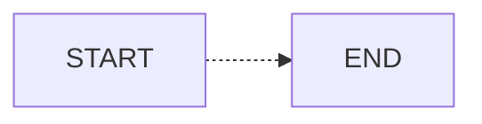

#需要学习知识点
- 1, 理解http请求过程 ?

- 2, 理解http状态码(200,302,404,501,502,503,504)?

- 3, 理解GET,POST请求区别 ?

- 4, 理解什么是url ,url如何传递参数 ?

- 5, 理解什么是MVC设计模式 ?

 - [x] This task is done
 - [ ] This is still pending
 
 
 
| h1    |    h2   |      h3 |
|:------|:-------:|--------:|
| 100   | [a][1]  | ![b][2] |
| *foo* | **bar** | ~~baz~~ |

